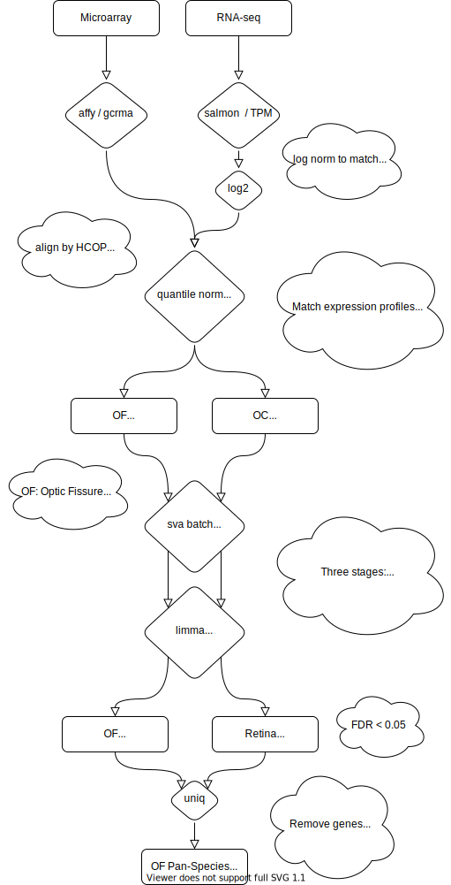

```{r, message=FALSE, message=FALSE, warning=FALSE}

library(tidyverse)
library(biomaRt)


library(clusterProfiler)
# Parallel
library(BiocParallel)
register(MulticoreParam(6))

load('../data/NGS_processing.Rdata')
load('../data/top_tables.Rdata')

box_marker <- function(table, genes, section = c('OF','OC')){
  qsmooth_counts %>%
    as_tibble(rownames = 'Gene') %>%
    pivot_longer(-Gene, names_to = 'Sample', values_to = 'Expression') %>%
    mutate(Sample = gsub('_.*|.CEL.*','',Sample)) %>%
    left_join(sample_meta_D) %>%
    mutate(S2 = case_when(Section == 'OF' ~ 'OF',TRUE ~ 'OC')) %>%
    filter(Gene %in% genes, S2 %in% section) %>%
    #filter(Gene %in% row.names(top.table_OF_AD %>% head(10))) %>%
    mutate(Fusion = factor(Fusion, levels = c('Before','During','After'))) %>%
    ggplot(aes(x=Fusion, y=Expression, color = Organism, shape = Technology)) +
    # geom_boxplot(aes(group = Fusion), color = 'Black', outlier.colour = NA) +
    # geom_boxplot(aes(group = interaction(Organism,Fusion)), outlier.colour = NA) +
    ggbeeswarm::geom_quasirandom(size = 3, alpha = 0.7) +
    cowplot::theme_cowplot() +
    facet_grid(~Gene + S2, scales = 'free_y') +
    ggsci::scale_color_aaas() +
    ylab('log2 (qn counts)') +
    stat_summary(fun=mean, geom = 'line', aes(group = Organism))
}

volcano_maker <- function(df, 
                          title="Volcano Plot", 
                          pvalue='P.Value', 
                          padj='adj.P.Val', 
                          logFC='logFC', 
                          gene_list = ''){
  df$pvalue <- df[,pvalue]
  df$log2FoldChange <- df[,logFC]
  df$padj <- df[,padj]
  df$Gene <- row.names(df)
  df <- df[!is.na(df$pvalue),]
  print(dim(df))

  df <- df %>% mutate(Class = case_when(padj < 0.05 & abs(logFC) > 1~ "FDR < 0.05 & logFC > 1",
                                        padj < 0.1 & abs(logFC) > 1 ~ 'FDR < 0.1 & logFC > 1',
                                        TRUE ~ 'Not significant'))
  df$GeneT <- df$Gene
  if (gene_list == ''){
    gene_list <- df %>% filter(padj < 0.05) %>% pull(Gene) %>% head(10)
  }
  df$Gene[!df$Gene %in% gene_list] <- ''

  plot <- ggplot(data=df,aes(label=Gene, x = log2FoldChange, y = -log10(pvalue))) +
    geom_point(aes(colour=Class)) +
    scale_colour_manual(values=c("darkred", "red", "grey")) +
    cowplot::theme_cowplot() +
    geom_vline(aes(xintercept=-1),linetype="dotted") +
    geom_vline(aes(xintercept=1),linetype="dotted") +
    geom_vline(aes(xintercept=-2),linetype="dotted") +
    geom_vline(aes(xintercept=2),linetype="dotted") +
    geom_label_repel(max.overlaps = 100) +
    xlab('logFC') + ylab('-log10(p value)') +
    ggtitle(title) + cowplot::theme_cowplot()

    plot
}
```
# Overall Workflow


# Samples
```{r}
sample_meta_D %>% 
  group_by(Organism, Fusion, Section, Technology) %>% 
  summarise(Count = n()) %>% 
   mutate(Fusion = factor(Fusion, levels = c('Before','During','After'))) %>%
  ggplot(aes(x=Fusion,y=Count, fill = Organism, shape = Technology))  + 
  geom_bar(stat='identity', position = position_dodge2()) + 
  ggsci::scale_fill_jco() +
  facet_wrap(~Section) +
  cowplot::theme_cowplot()

sample_meta_D %>% 
  mutate(Section2 = case_when(Section == 'OF' ~ 'OF',TRUE ~ 'OC')) %>%
   mutate(Fusion = factor(Fusion, levels = c('Before','During','After'))) %>%
  group_by(Organism, Fusion, Section2, Technology) %>% 
  summarise(Count = n()) %>% 
  ggplot(aes(x=Fusion,y=Count, fill = Organism, shape = Technology))  + 
  geom_bar(stat='identity', position = position_dodge2()) + 
  ggsci::scale_fill_jco() +
  facet_wrap(~Section2) +
  cowplot::theme_cowplot()
```
# Four Tests

- During vs Before (OF)
- During vs Before (OC (well... not OF))
- During vs After (OF)
- During vs After (OC) (well... not OF))

## During vs Before (OF)

Negative means that expression is dropping from as the fissure goes from "before" to "during."

### Volcano
```{r}
volcano_maker(top.table_OF_DB, title = 'Optic Fissure - Before/During',
              
              gene_list = c(top.table_OF_DB %>% filter(logFC > 0) %>% head(5) %>% row.names(),
                            top.table_OF_DB %>% filter(logFC < 0) %>% head(5) %>% row.names()))
```
### Diff Table

All genes with an FDR < 0.2. Not very many. There are a limited number of samples *before* the fusion begins (and no human) compared to the other time points. 

```{r}
top.table_OF_DB %>% as_tibble(rownames = 'Gene') %>% filter(adj.P.Val < 0.2) %>%  DT::datatable()
```
### Expression of top 6 genes across species and stage

```{r, fig.width=6, fig.height=3}
box_marker(top.table_OF_DB, 
           genes = top.table_OF_DB %>% 
             as_tibble(rownames = 'Gene') %>% 
             filter(adj.P.Val < 0.05) %>% head(6) %>% pull(Gene),
           section = 'OF')

box_marker(top.table_OF_DB, 
           genes = top.table_OF_DB %>% 
             as_tibble(rownames = 'Gene') %>% 
             filter(adj.P.Val < 0.05) %>% head(6) %>% pull(Gene),
           section = 'OC')
```


## After vs During (OF)

Negative means that expression is dropping from as the fissure goes from "during" to "after"

### Volcano
```{r}
volcano_maker(top.table_OF_AD, 
              title = 'Optic Fissure - Before/During',
              gene_list = c(top.table_OF_AD %>% filter(logFC > 0) %>% head(5) %>% row.names(),
                            top.table_OF_AD %>% filter(logFC < 0) %>% head(5) %>% row.names()))
```
### Diff Table

All genes with an FDR < 0.1

```{r}
top.table_OF_AD %>% as_tibble(rownames = 'Gene') %>% filter(adj.P.Val < 0.1) %>%  DT::datatable()
```
### Expression of top 7 genes across species (OF only samples)

```{r, fig.width=8, fig.height=3}
box_marker(top.table_OF_AD, 
           genes = top.table_OF_AD %>% 
             as_tibble(rownames = 'Gene') %>% 
             filter(adj.P.Val < 0.05) %>% pull(Gene) %>% 
             head(7),
           section = 'OF')
```

# Enrichment Analysis (GO and Pathway)

## Before -> During
###  GSEA
```{r, fig.width=5}
all_genes <- bitr(top.table_OF_DB %>% as_tibble(rownames = 'Gene') %>% pull(Gene), fromType="SYMBOL", toType="ENTREZID", OrgDb="org.Hs.eg.db")
all_genes <- all_genes %>% left_join(top.table_OF_DB %>% as_tibble(rownames = 'SYMBOL'), by = c('SYMBOL'))

logFC <- all_genes$logFC
names(logFC) <- all_genes$ENTREZID
logFC <- na.omit(logFC)

logFC = sort(logFC, decreasing = TRUE)

gse <- gseGO(geneList=logFC,
             ont ="ALL",
             keyType = "ENTREZID",
             pvalueCutoff = 0.05,
             OrgDb = org.Hs.eg.db,
             pAdjustMethod = "BH")
dotplot(gse, showCategory=10, split=".sign") + facet_grid(.~.sign)
```

### GO Enrichment 
```{r}
library(clusterProfiler)
library(enrichplot)


diff_genes <- top.table_OF_DB %>% as_tibble(rownames = 'Gene') %>% filter(adj.P.Val < 0.05)
eg_diff_genes <- bitr(diff_genes$Gene, fromType="SYMBOL", toType="ENTREZID", OrgDb="org.Hs.eg.db")
eg_diff_genes <- diff_genes %>% left_join(., eg_diff_genes, by = c('Gene' = 'SYMBOL'))
eg_universe = bitr(top.table_OF_DB %>% as_tibble(rownames = 'Gene') %>% pull(Gene), fromType="SYMBOL", toType="ENTREZID", OrgDb="org.Hs.eg.db")


egoOF_DB <- enrichGO(gene          = eg_diff_genes$ENTREZID,
                  universe      = eg_universe$ENTREZID,
                  OrgDb         = org.Hs.eg.db,
                  ont           = "all",
                  readable      = TRUE)


p1 <- dotplot(egoOF_DB, showCategory=30) + ggtitle("Dotplot for GO, OF")
p1


```

### "CNET" Plot
Relationships between related GO terms with shared genes
```{r, fig.width=6, fig.height=4}
geneList <- eg_diff_genes$logFC
names(geneList) <- eg_diff_genes$Gene
cnet <- cnetplot(egoOF_DB, foldChange = geneList) + scale_color_viridis_c(name = 'log2(FoldChange)')
cnet
```

## Wikipathways
```{r}
# system("wget https://wikipathways-data.wmcloud.org/current/gmt/wikipathways-20211110-gmt-Homo_sapiens.gmt")
wp2gene <- read.gmt('wikipathways-20211110-gmt-Homo_sapiens.gmt')
wp2gene <- wp2gene %>% tidyr::separate(term, c("name","version","wpid","org"), "%")
wpid2gene <- wp2gene %>% dplyr::select(wpid, gene) #TERM2GENE
wpid2name <- wp2gene %>% dplyr::select(wpid, name) #TERM2NAME

ewp <- enricher(eg_diff_genes$ENTREZID,
                TERM2GENE = wpid2gene,
                TERM2NAME = wpid2name,
                pvalueCutoff = 0.1)

ewp_plot <- dotplot(ewp, showCategory=30) + ggtitle("Dotplot for WikiPathways")
ewp_plot
```
## OF, Before <-> During OF

## GSEA
```{r, fig.width=5}
all_genes <- bitr(top.table_OF_DB %>% as_tibble(rownames = 'Gene') %>% pull(Gene), fromType="SYMBOL", toType="ENTREZID", OrgDb="org.Hs.eg.db")
all_genes <- all_genes %>% left_join(top.table_OF_DB %>% as_tibble(rownames = 'SYMBOL'), by = c('SYMBOL'))

logFC <- all_genes$logFC
names(logFC) <- all_genes$ENTREZID
logFC <- na.omit(logFC)

logFC = sort(logFC, decreasing = TRUE)

gse <- gseGO(geneList=logFC,
             ont ="ALL",
             keyType = "ENTREZID",
             pvalueCutoff = 0.05,
             OrgDb = org.Hs.eg.db,
             pAdjustMethod = "BH")
dotplot(gse, showCategory=10, split=".sign") + facet_grid(.~.sign)
```

## KEGG Pathway Enrichment
```{r, fig.width=3}
kk <- enrichKEGG(gene         = eg_diff_genes$ENTREZID, 
                 universe = eg_universe$ENTREZID,
                 organism     = 'hsa')
dotplot(kk) + ggtitle("KEGG Pathway Enrichment") 
```


# Session Info
```{r}
devtools::session_info()
```
