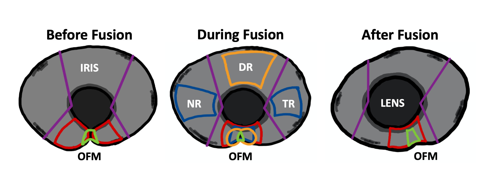
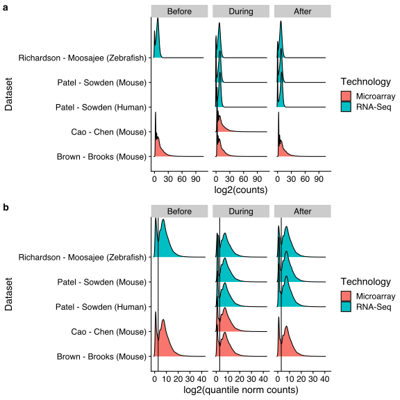

```{r, message=FALSE, message=FALSE, warning=FALSE}

library(tidyverse)
load('../data/NGS_processing.Rdata')
load('../data/top_tables.Rdata')
sva_counts <- read_tsv('../data/sva_counts.tsv.gz')
```

# 2021-12-06

# Samples

I have highly simplified the many different sections to .... two. I assume this is biologically kosher? I mean I would assume that the DR/NR/TR is all kind of the same....compared to the fissure. My diff testing thus has two "sections" as the fissure and ... everything else. Which I'll call optic cup.




```{r}
sample_meta_D <- sample_meta %>% filter(Sample %in% colnames(sva_counts)) %>%
  dplyr::select(Sample:Section, Layout:Fusion) %>%
  mutate(S2 = case_when(Section == 'OF' ~ 'OF', TRUE ~ 'OC')) %>%
  unique()

sample_meta_D %>% 
  group_by(Organism, Fusion, Section, Technology) %>% 
  summarise(Count = n()) %>% 
   mutate(Fusion = factor(Fusion, levels = c('Before','During','After'))) %>%
  ggplot(aes(x=Fusion,y=Count, fill = Organism, shape = Technology))  + 
  geom_bar(stat='identity', position = position_dodge2()) + 
  ggsci::scale_fill_jco() +
  facet_wrap(~Section) +
  cowplot::theme_cowplot()

sample_meta_D %>% 
  mutate(Section2 = case_when(Section == 'OF' ~ 'OF',TRUE ~ 'OC')) %>%
   mutate(Fusion = factor(Fusion, levels = c('Before','During','After'))) %>%
  group_by(Organism, Fusion, Section2, Technology) %>% 
  summarise(Count = n()) %>% 
  ggplot(aes(x=Fusion,y=Count, fill = Organism, shape = Technology))  + 
  geom_bar(stat='identity', position = position_dodge2()) + 
  ggsci::scale_fill_jco() +
  facet_wrap(~Section2) +
  cowplot::theme_cowplot()
```

# Overall Workflow

Partially for my benefit, partially for yours. The analysis ended up being a lot more complicated than I hoped, but it seems to work (in the sense that the results, I think, make biological sense). 


## Why do we need to do quantile norm?

The first set of density plots (a) shows how the microarray count distribution is wildly different than the RNA-seq count distributions. The quantile norm "smooshes" them all together so the differential testing (which assumes fairly similar overall distributions) has a chance to work. 



# Six sample "sets"

  - OF (optic fissure):
    - before
    - during
    - after
  - OC (optic cup...or really the *not* optic fissure samples)
    - before (ZF ONLY!!!!)
    - during
    - after 
  
2 ^ 6 (64) possible combinations of tests (e.g. OF After vs OC Before)

The *three* most important ones are (in my opinion):

  - OF Before - During
  - OF During - After
  - OF During - OC During
  
# Three analysis documents for the three tests above

  - analysis_OF_BeforeDuring.html
  - analysis_OF_AfterDuring.html (as of 2021-12-06, not made yet)
  - analysis_OF_OC.html (as of 2021-12-06, not made yet)
  
# Five data files

  - sva_counts_merge.tsv.gz (sample - gene counts collapsed (mean) by technology, stage, and organism)
  - sva_counts.tsv.gz (all sample - gene NORMALIZED counts)
  - top.table_OF_DB.tsv.gz (diff testing (logFC) for OF Before - During)
  - top.table_OF_AD.tsv.gz (diff testing (logFC) for OF During - After)
  - top.table_OF_OC_During.tsv.gz (diff testing (logFC) for OF vs OC at the During stage)
  
# Session Info
```{r}
devtools::session_info()
```
