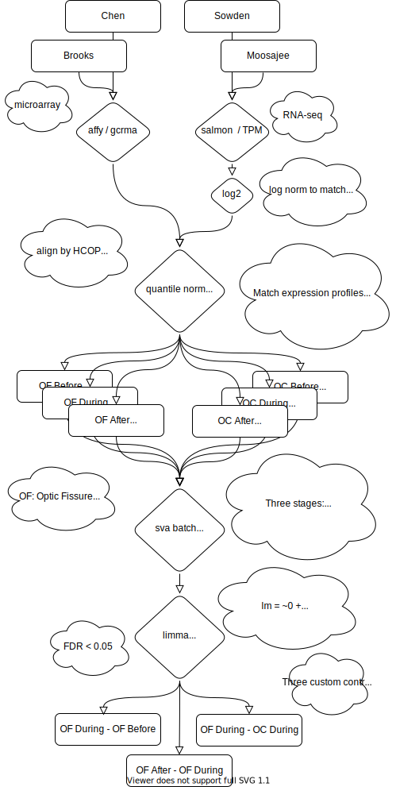

```{r, message=FALSE, message=FALSE, warning=FALSE}

library(tidyverse)

load('../data/NGS_processing.Rdata')
load('../data/top_tables.Rdata')

```


# Samples

I have highly simplified the many different sections to .... two. So this is a discussion point as to whether this is biological relevant. Essentially the two sections are now the fissure and ... everything else. Which I'll call optic cup.


```{r}
sample_meta_D %>% 
  group_by(Organism, Fusion, Section, Technology) %>% 
  summarise(Count = n()) %>% 
   mutate(Fusion = factor(Fusion, levels = c('Before','During','After'))) %>%
  ggplot(aes(x=Fusion,y=Count, fill = Organism, shape = Technology))  + 
  geom_bar(stat='identity', position = position_dodge2()) + 
  ggsci::scale_fill_jco() +
  facet_wrap(~Section) +
  cowplot::theme_cowplot()

sample_meta_D %>% 
  mutate(Section2 = case_when(Section == 'OF' ~ 'OF',TRUE ~ 'OC')) %>%
   mutate(Fusion = factor(Fusion, levels = c('Before','During','After'))) %>%
  group_by(Organism, Fusion, Section2, Technology) %>% 
  summarise(Count = n()) %>% 
  ggplot(aes(x=Fusion,y=Count, fill = Organism, shape = Technology))  + 
  geom_bar(stat='identity', position = position_dodge2()) + 
  ggsci::scale_fill_jco() +
  facet_wrap(~Section2) +
  cowplot::theme_cowplot()
```

# Overall Workflow

Partially for my benefit, partially for yours. The analysis ended up being a lot more complicated than I hoped, but it seems to work (in the sense that the results I think make biological sense). 



# Six sample "sets"

  - OF (optic fissure):
    - before
    - during
    - after
  - OC (optic cup...or really the *not* optic fissure samples)
    - before (ZF ONLY!!!!)
    - during
    - after 
  
2 ^ 6 (64) combinations of tests (e.g. OF After vs OC Before)

The *three* most important ones are (in my opinion):
  - OF Before - During
  - OF During - After
  - OF During - OC During
  
  
# Three documents

  - analysis_OF_BeforeDuring
  - analysis_OF_AfterDuring
  - analysis_OF_OC
  
# Five data files

  - ngs_counts_merge.tsv.gz (samples collapsed by technology, stage, and organism)
  - 

# Session Info
```{r}
devtools::session_info()
```
